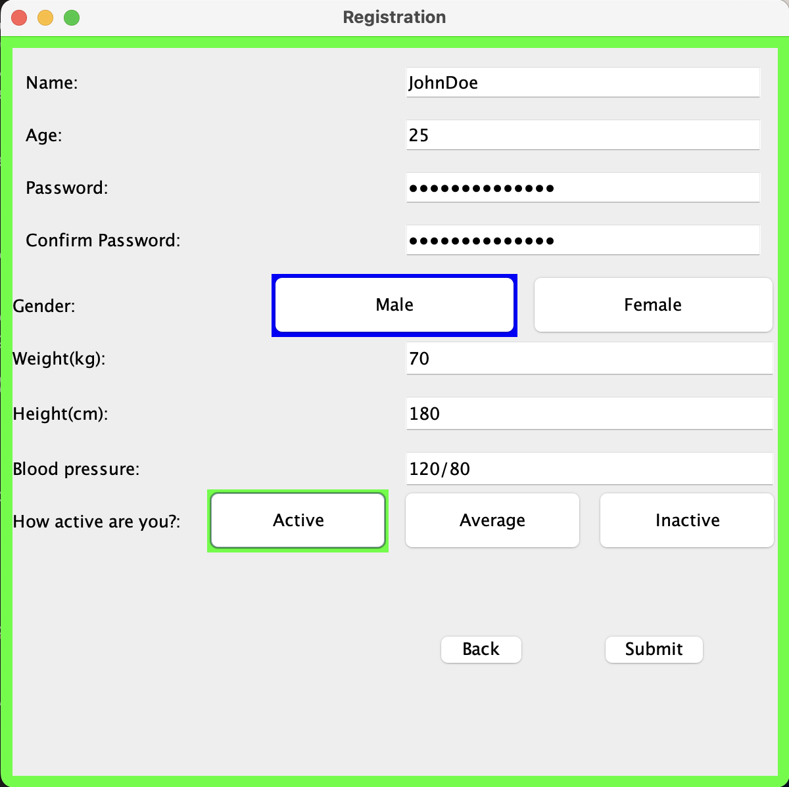
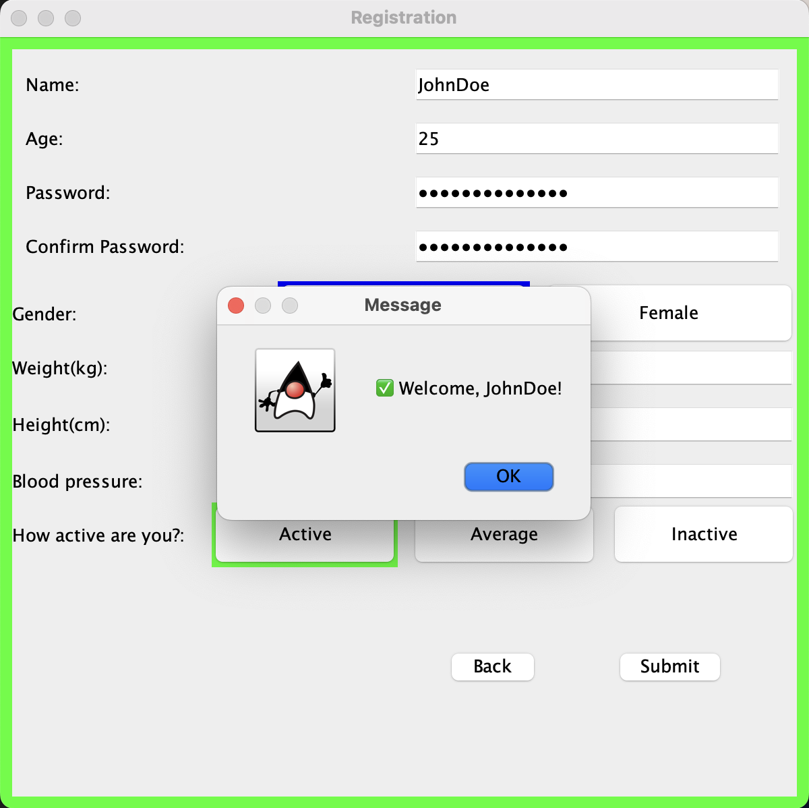
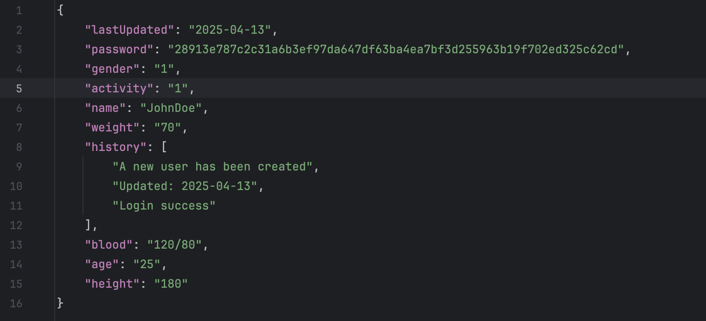
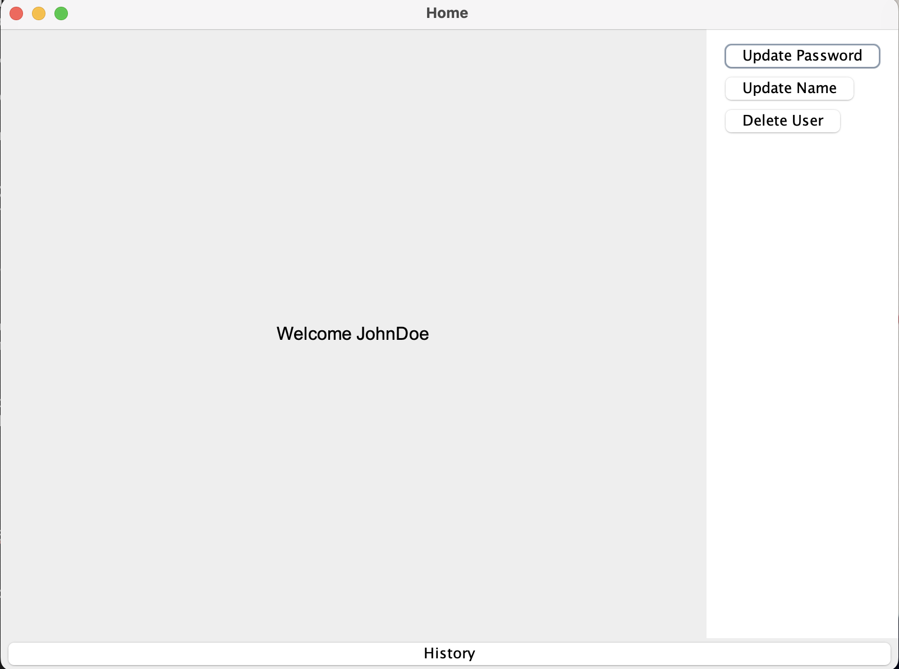
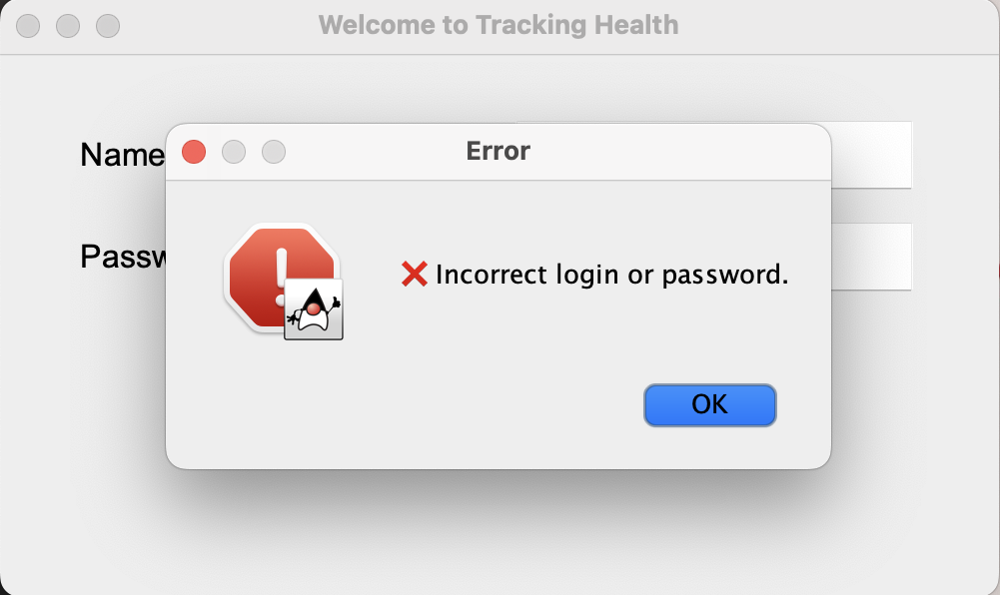
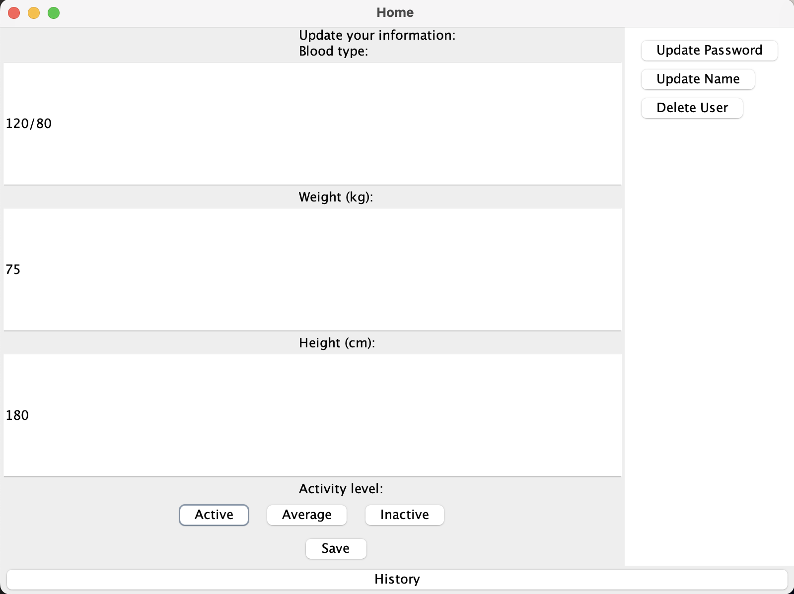
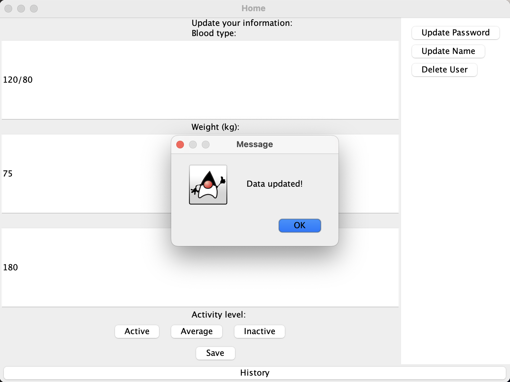
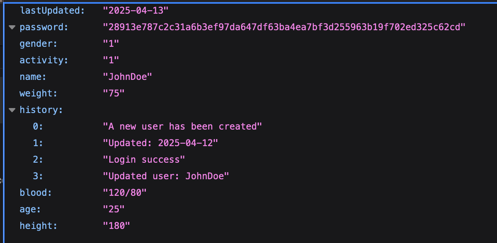
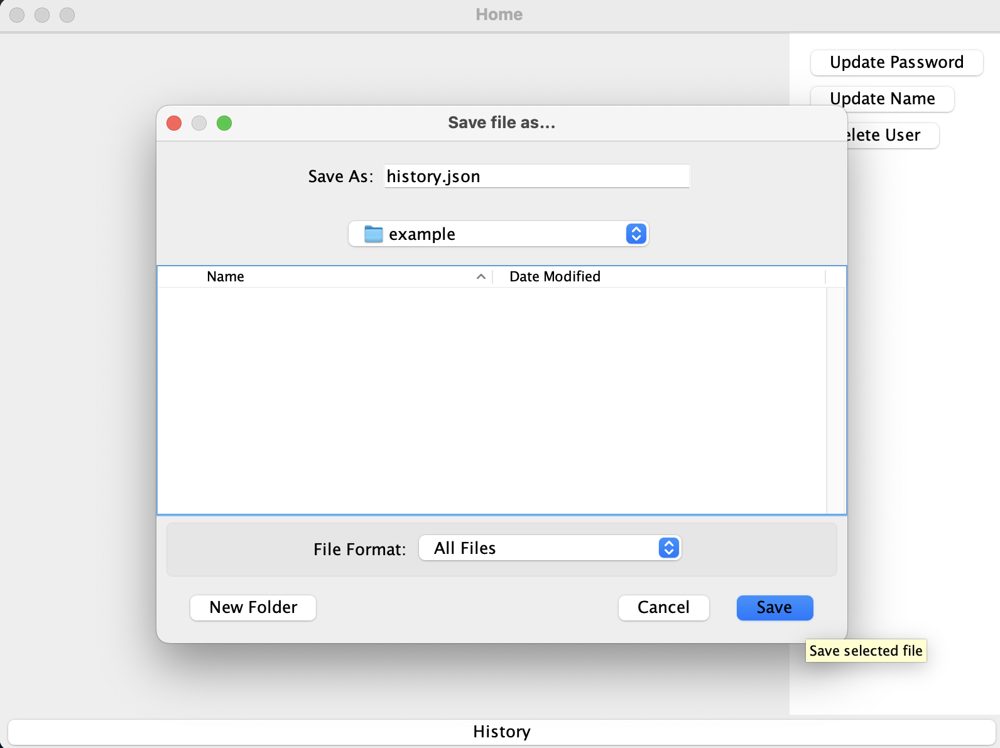

# Project: Health Tracking System

## 1. Project Name and Short Description

**Health Tracking System**

This project is a system to track users' health data. It allows users to register their information, log in with a username and password, and manage data like age, weight, height, and activity level.

**Student's Name**: Ashirova Alina

**Project Goal**:  
The goal of this project is to create an application for tracking users' health data with a graphical user interface. The project includes user registration, login, saving user information in JSON files, and managing these data.

**Main Tasks**:
- Implement user registration and login system.
- Save user data in JSON format.
- Implement input validation.
- Secure password storage using hashing.
- Create a user-friendly interface to manage data.

---

## 2. List of Project Requirements

1. Implement a user registration system with personal data input (name, age, weight, height, etc.).
2. Implement a login system with a username and password.
3. Use password hashing for security.
4. Save user data in JSON format.
5. Check the uniqueness of the username during registration.
6. Validate input data (name, age, password).
7. Create a graphical interface using Swing.
8. Allow users to update their personal data through the interface.
9. Allow users to delete their account through the interface.
10. Keep a history of changes made to the user data.

---

## 3. Documentation

### Algorithms:
1. **Login Algorithm**:
   - The user enters their username and password.
   - The program searches for the user's file.
   - If the file is found, the program checks if the entered password is correct.
   - If successful, the user is directed to the main screen; otherwise, an error message is shown.

2. **Registration Algorithm**:
   - The user enters their data (name, age, weight, height, etc.).
   - The program checks if the username is unique.
   - The data is saved in a JSON file.

3. **File Handling Algorithm**:
   - All user data is stored in separate JSON files.
   - Jackson library is used for serializing and deserializing the objects.

### Data Structures:
- **Person**: a class that represents a user with fields for their name, password, age, weight, height, activity level, and history of changes.
- **History**: a list that stores the history of changes made to the user's data.

### Modules:
- **Database**: a module for working with user files, password hashing, and saving data.
- **isValid**: a module for input validation (e.g., checking password correctness).
- **MainLabel**: the main module that handles the graphical interface, including the login and registration screens.
- **HomeLabel**: the module for handling the user's home screen after login, including updating user data, exporting history, and user management.
  - The `HomeLabel` class provides a home screen after the user logs in. It allows users to update their personal data (weight, height, blood type, activity level), manage their accounts (update name, password, or delete the account), and save their history. It also manages the display of a popup for data updates, ensuring users are prompted to update their information only once a day.

### Problems Encountered:
- Issues with correctly reading and writing data to JSON files.
- Setting up proper password hashing using SHA-256.
- Handling errors when trying to open non-existent files.

---

## 4. Test Cases and Output

### Example 1: Registering a New User
**Input**:
- Username: JohnDoe
- Password: password123%^&
- Confirm Password: password123%^&
- Age: 25
- Weight: 70
- Height: 180
- Activity Level: Active
- Blood Pressure: 120/80

**Output**:
- User successfully registered.
- Data file saved in the directory: `Users/JohnDoe.json`.

**Screenshot**:  

---

### Example 2: Logging in with Incorrect Password
**Input**:
- Username: JohnDoe
- Password: wrongPassword

**Output**:
- Error: Incorrect username or password.

**Screenshot**:  

---

### Example 3: Updating User Data
**Input**:
- Username: JohnDoe
- New Weight: 75

**Output**:
- User data updated, new information saved in JSON file.

**Screenshot**:  

---

### Example 4: Exporting User History
**Input**:
- Username: JohnDoe

**Output**:
- User history file saved as `history.json`.
- A message confirming the file save path is shown.

**Screenshot**:  

---

## 5. Code

The project code consists of several classes responsible for different functions:
- **Main**: the main class to start the application.
- **MainLabel**: the graphical interface for login and registration.
- **Database**: the module for working with user data and saving it to a file.
- **Person**: a structure for storing user data.
- **isValid**: a module for validating user inputs.
- **Error**: a module for displaying error messages.
- **HomeLabel**: handles the user home screen with the ability to update personal data, export history, and manage the user's account.
